# End-to-End Gaming Retention Analytics Project

## Overview

This project analyzes player registration and authentication activity data to measure user acquisition, engagement, and retention performance within a gaming environment.

Using Python, Pandas, MySQL, SQL, and Power BI, the project transforms raw gaming activity data into actionable business insights through KPI reporting, retention analysis, cohort analysis, and interactive dashboard development.

The solution demonstrates a complete end-to-end analytics workflow from data preparation and database loading to reporting and business intelligence visualization.

---

## Business Objectives

This project aims to answer key gaming analytics questions:

* How many players are active on a daily basis?
* How many players are active on a monthly basis?
* How effectively does the platform acquire new players?
* What percentage of players return after registration?
* How does player engagement evolve over time?
* Which player cohorts demonstrate stronger retention performance?
* How can retention metrics support product and growth decisions?

---

## Technology Stack

* Python
* Pandas
* MySQL
* SQLAlchemy
* SQL
* Jupyter Notebook
* Power BI
* Cohort Analysis
* Retention Analytics

---

## Project Workflow

**Raw Gaming Data → Python Data Cleaning → MySQL Database Loading → SQL KPI Analysis → Reporting Views → CSV Export → Power BI Dashboard**

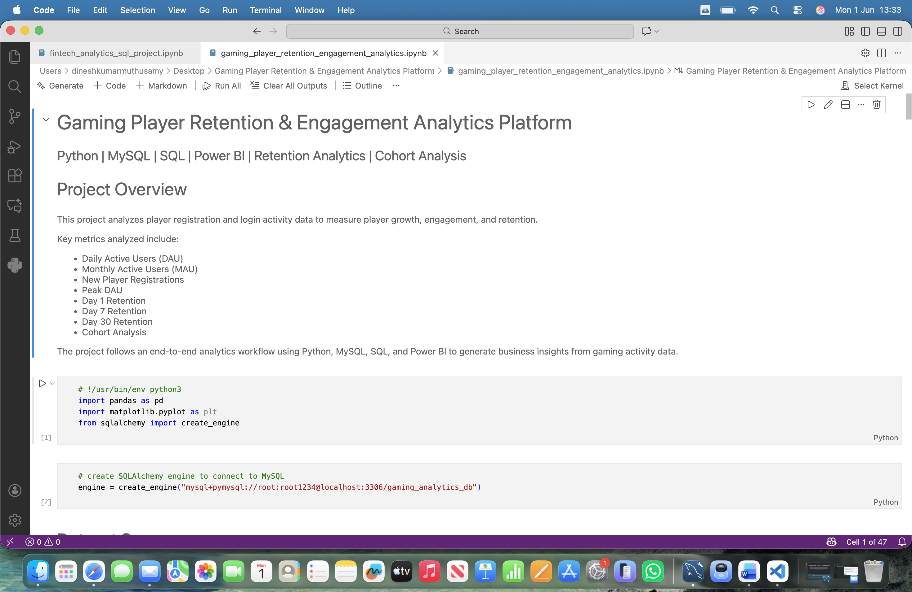

---

## Dataset

### Dataset Source

Gamelytics Mobile Analytics Challenge Dataset

https://www.kaggle.com/datasets/debs2x/gamelytics-mobile-analytics-challenge

### Dataset Overview

The dataset contains player registration and authentication activity data from a mobile gaming platform and is used to analyze user acquisition, engagement, and retention behavior.

### Data Availability

The original raw dataset is not included in this repository due to file size limitations.

To support project reproducibility, the repository includes sample reporting datasets generated from cleaned MySQL reporting views:

* `vw_gaming_dashboard.csv`
* `vw_cohort_analysis.csv`

These files are located in the `data_sample` folder and were used as the final Power BI data source.

---

## Data Sample

The `data_sample` folder contains cleaned reporting datasets exported from MySQL views and used for Power BI dashboard development.

Files included:

* `vw_gaming_dashboard.csv`
* `vw_cohort_analysis.csv`

These files represent the final analytical layer used for KPI reporting, retention analysis, cohort analysis, and Power BI dashboard development.

---

## Key Performance Indicators (KPIs)

### Daily Active Users (DAU)

Measures the number of unique players who logged into the platform each day.

### Monthly Active Users (MAU)

Measures the number of unique players who logged into the platform each month.

### New Player Registrations

Tracks player acquisition and registration growth over time.

### Peak Daily Active Users

Identifies the highest daily engagement level achieved by the platform.

### Day 1 Retention Rate

Measures the percentage of players returning one day after registration.

### Cohort Analysis

Evaluates retention performance across player signup cohorts to identify engagement patterns over time.

---

## Project Screenshots

### Dataset Scope and Data Loading

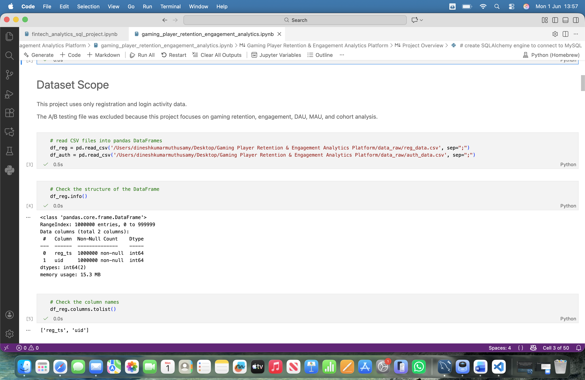

### Registration Timestamp Processing

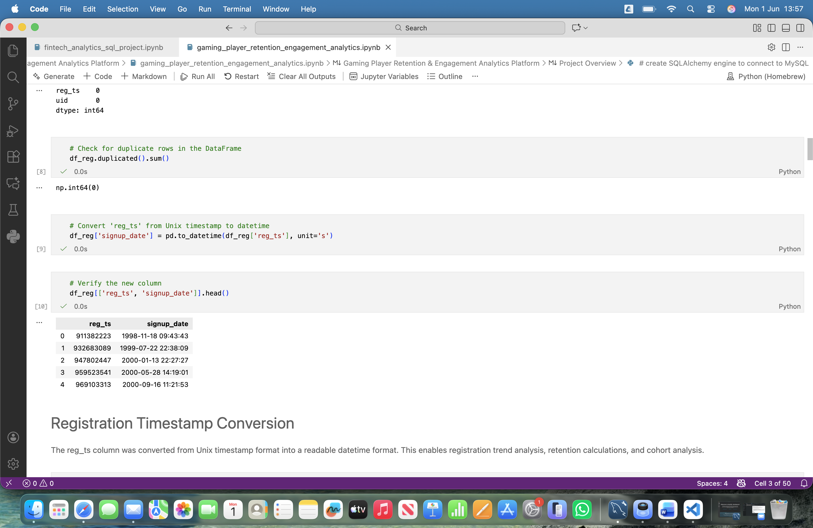

### Login Data Loading into MySQL

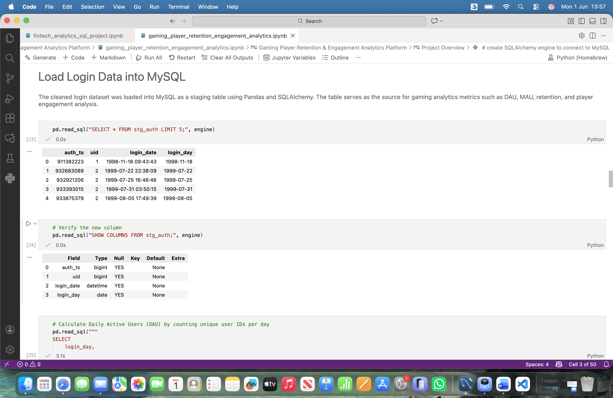

### Daily Active Users (DAU) Analysis

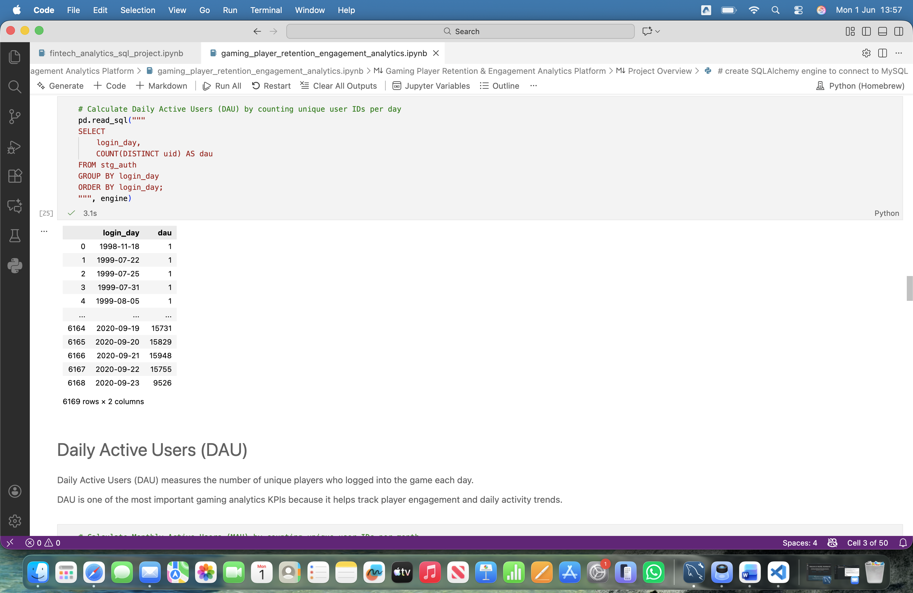

### Monthly Active Users (MAU) Analysis

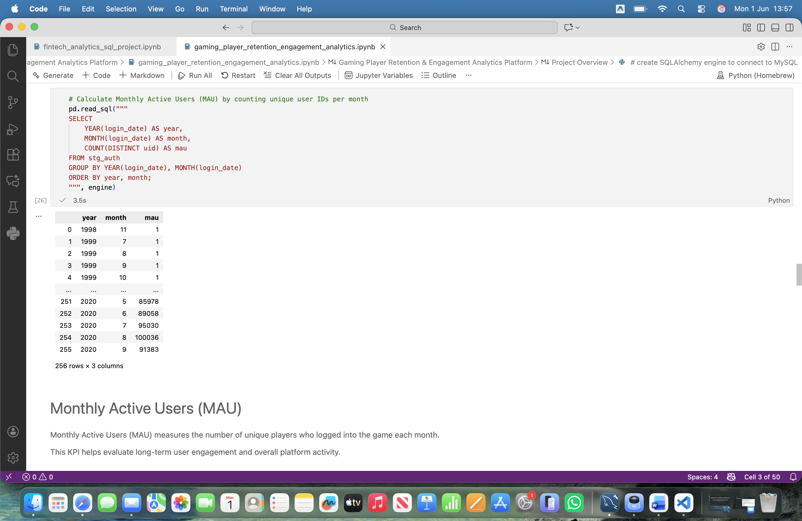

### New Player Registrations Analysis


### Peak Daily Active Users Analysis

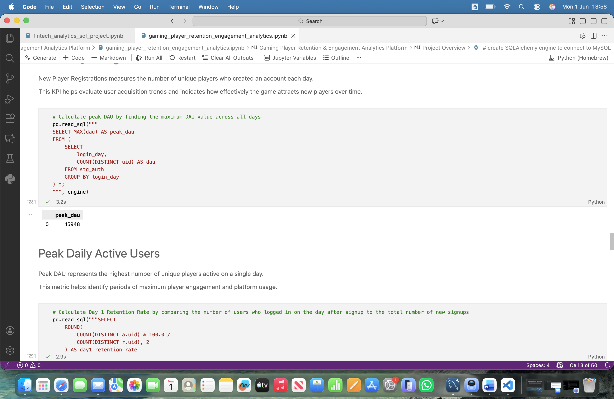

### Day 1 Retention Analysis


### Cohort Analysis

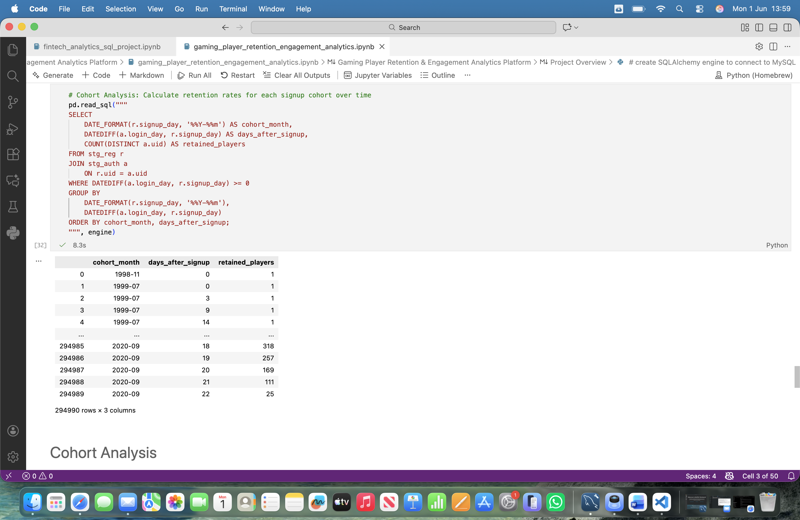

### Power BI Reporting View

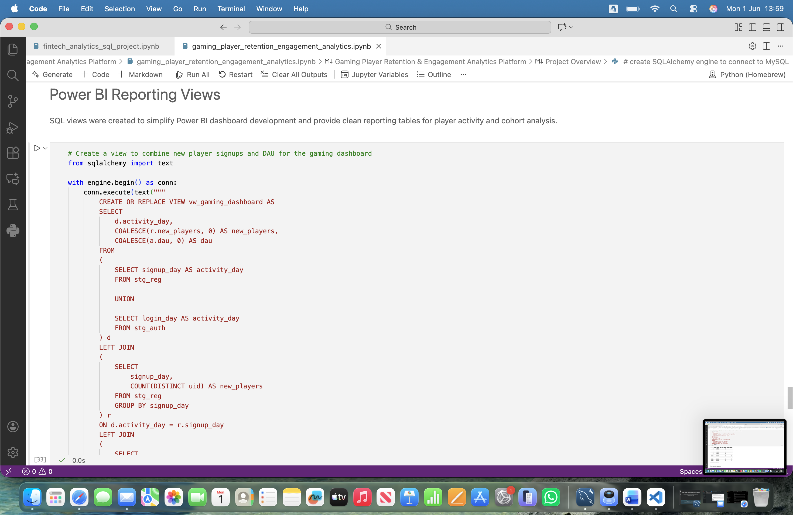

### Power BI Data Loading

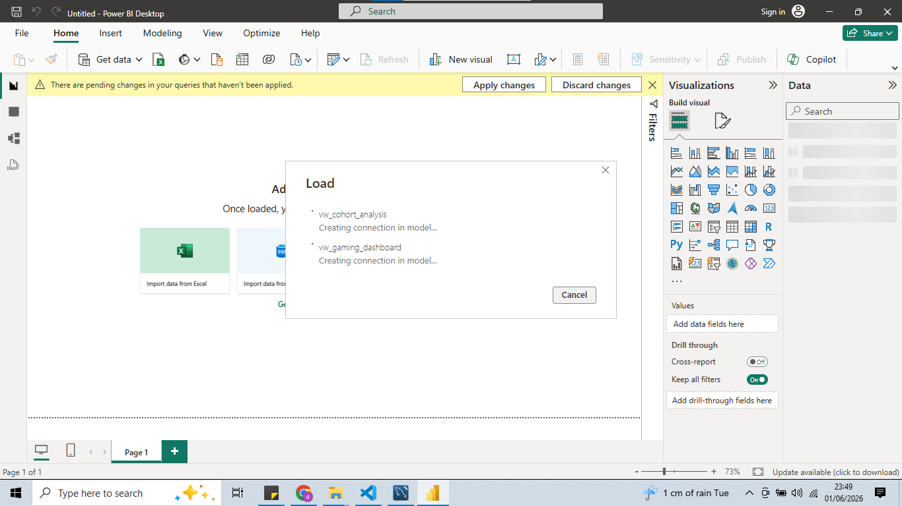

### Data Model Relationships

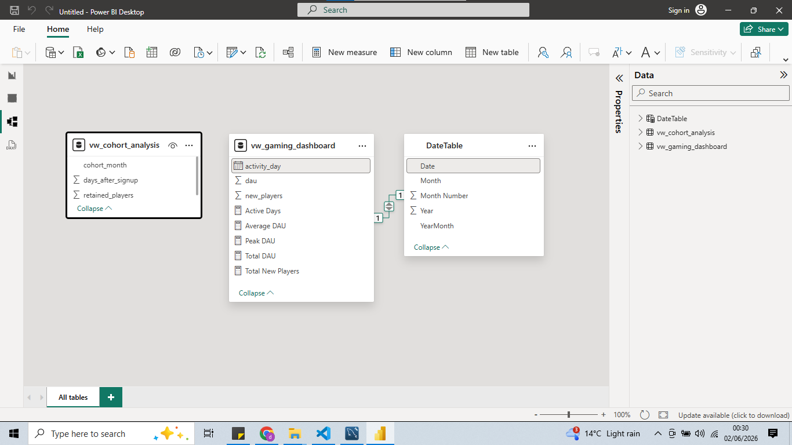

### Gaming Dashboard - Page 1

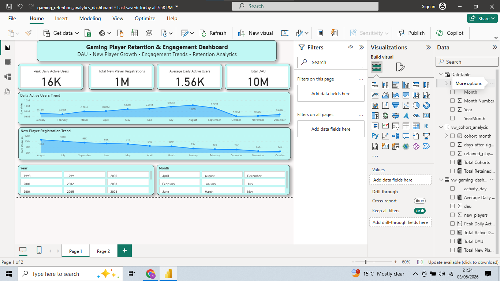

### Cohort Retention Dashboard - Page 2

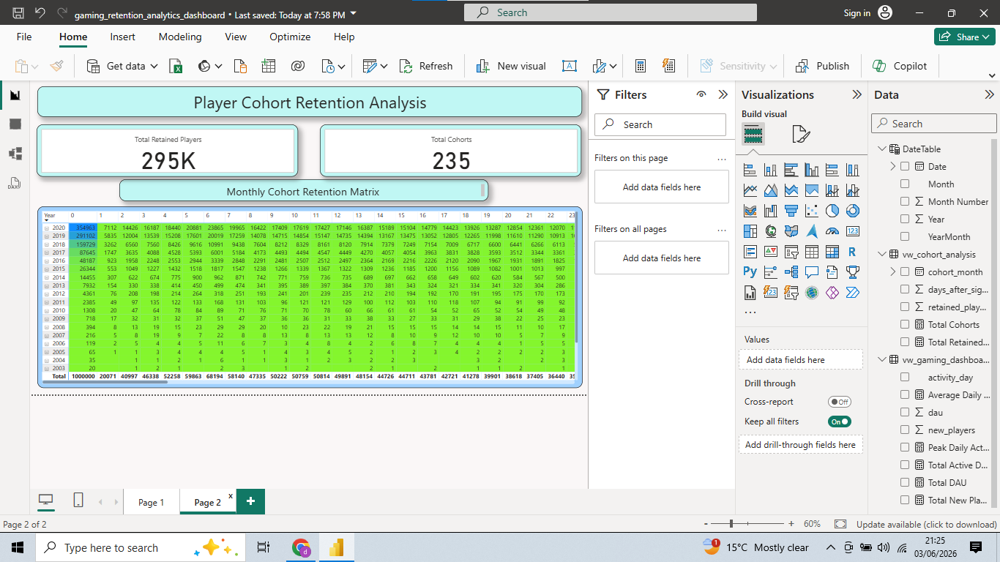

---

## Power BI Dashboard

The Power BI dashboard provides interactive reporting and visualization for:

* Daily Active Users (DAU)
* Monthly Active Users (MAU)
* New Player Registrations
* Retention Analysis
* Cohort Analysis
* Player Engagement Trends

### Dashboard Features

* KPI Cards
* Trend Analysis
* Cohort Retention Matrix
* Interactive Filtering
* Business Intelligence Reporting

---

## Project Demo Videos

### Python & MySQL Analytics Workflow

https://youtu.be/b0_FT7UegdE

This video demonstrates the end-to-end analytics workflow, including:

* Python Data Cleaning
* Pandas Data Processing
* MySQL Database Loading
* SQL KPI Analysis
* Reporting View Creation
* DAU Analysis
* MAU Analysis
* New Player Registration Analysis
* Day 1 Retention Analysis
* Cohort Analysis

### Power BI Dashboard Demo

https://youtu.be/95fbNeCtw8Y

This video showcases the final Power BI dashboard, including:

* Gaming Analytics Dashboard
* KPI Visualizations
* Daily Active Users (DAU)
* Monthly Active Users (MAU)
* New Player Registrations
* Retention Metrics
* Cohort Retention Dashboard
* Interactive Reporting Features


---

## Repository Structure

```text
end-to-end-gaming-retention-analytics-project
│
├── data_sample
├── demo_video
├── screenshots
├── gaming_player_retention_engagement_analytics.ipynb
├── gaming_retention_analytics_dashboard.pbix
└── README.md
```

---

## Key Deliverables

* Daily Active User Analysis
* Monthly Active User Analysis
* New Player Registration Analysis
* Day 1 Retention Analysis
* Cohort Retention Analysis
* SQL KPI Reporting
* Power BI Dashboard Development
* End-to-End Analytics Workflow

---

## Conclusion

This project demonstrates a complete gaming analytics workflow designed to support data-driven decision-making.

The analysis provides insights into player acquisition, engagement, retention behavior, and cohort performance while showcasing practical experience with Python, Pandas, MySQL, SQL, Power BI, and business-focused analytics.
